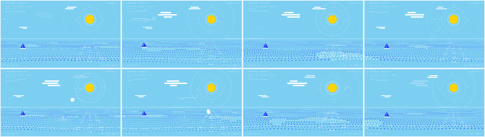

# Clear Horizon — 15秒ループ



海と澄んだ空を、点と線と図形だけで描いた 15 秒のシームレスループ。[ショーリール](../showreel/)の HUD、スペック行、ドット、跳ねる白い点といったビジュアル言語を引き継ぎ、テンポは 64 BPM に落としています。

- **[`clear-horizon.mp4`](clear-horizon.mp4)** — 完成版。1920×1080 / 60p / H.264 + AAC 320kbps / 15.000 秒 / -16 LUFS。プレイヤーのループ再生でつなぎ目なく回ります
- **`index.html`** — エンジン本体。ブラウザで開くとリアルタイムでループ再生・スクラブができます
- **`render.mjs`** — 書き出しスクリプト（ショーリールと同じ仕組み）

## 色は4色だけ

| 役割 | 色 |
|---|---|
| ベース（空と水） | 水色 `#7CCFF2` |
| 光・泡・線 | 白 `#FFFFFF` |
| 海の深さ・帆 | クラインブルー `#2A3BFF`（ショーリールから継承） |
| 太陽 | イエロー `#FFD400`（この1点だけ） |

## 何で海と空を表しているか

| モチーフ | 表現 |
|---|---|
| 海面 | 約3,000個の点を透視図法で並べたフィールド。波の高さ h(x, z, t) で上下し、波頭の点だけが白に変わる |
| 波 | 点の列に沿って流れる白い破線 |
| 水平線 | 目盛り付きの1本の線。小節ごとに光のセグメントが端から端へ走る |
| 太陽 | 黄色の円と、逆回転する2本の破線の軌道、レジストレーションマーク。小節の頭ごとにリングが広がる |
| 太陽の反射 | 点の列に乗った短い白線の柱 |
| 雲 | 積み重ねた白いバー。1拍ごとに1本ずつ長さがイージングで切り替わる |
| 帆船 | クラインブルーの三角形2枚。波の傾きに合わせて揺れる |
| 生き物 | 3小節目にショーリールの白い点が海から跳ねる。軌道はモーションパス（点線）とキーフレームのひし形で予告し、着水で波紋が点の海を揺らす |
| 風・鳥 | トリムパスで描かれて消える線、V字の線 |

四隅の HUD（トリムマーク、タイムコード、小節/拍カウンタ）、スペック行、帆の上下動を描くオシロスコープは、ショーリールのグラフエディタを簡略化したものです。

## 音と同期

- 64 BPM × 4小節 = ちょうど 15 秒。D メジャーで Dmaj9 → Bm9 → Gmaj9 → A6/9 と進み、頭に戻る
- アルペジオ（8分音符、ベル系の音）の1音ごとに、海面にきらめきが1つ出る
- 小節の頭で、太陽のリング、点の海の波紋、水平線の光が同時に動き、波のうねりの音もそれに合わせる
- 白い点の跳躍と着水には、しぶきの音が付いている

## シームレスループの仕組み

- 動くものはすべて周期 15 秒の関数です（`cyc(t, n)`、`osc(t, n)` は1ループに整数回だけ回る）。破線のオフセットも1周期内に折り返しているので、フレーム 900 はフレーム 0 と同じ絵になります。検証では、全画素のうちタイムコードの文字以外は完全に一致しました
- 各フレームの描画前に canvas のストローク状態をリセットし、どのフレームから描き始めても同じ結果になるようにしています
- 音は 3 周分をオフラインでレンダリングし、真ん中の 1 周だけを切り出しています。リバーブやディレイの残響が前の周から自然に流れ込むので、つなぎ目にプチッというノイズは出ません（ループ点での段差 0.0018 に対し、ループ内の最大段差は 0.28）
- AAC は 256kbps だと冒頭のキックで 3.6dB ほどオーバーシュートしたため、320kbps で書き出しています

## 書き出し

```bash
cd clear-horizon
npm install
FFMPEG=/path/to/ffmpeg node render.mjs                         # → out/clear-horizon.mp4
FFMPEG=/path/to/ffmpeg node render.mjs --stills 0,450,899      # 確認用の静止画
```
