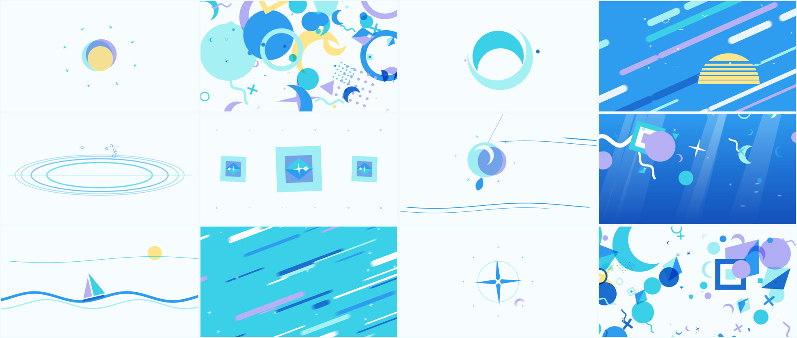

# Seaglass — 15秒ループ（Clear Horizon の別案）



[Clear Horizon](../clear-horizon/) と同じ色とテーマ（海・空・風、参考画像の白・アジュール・ターコイズ・深い青・ラベンダー・淡い黄色）で作った、図形主体の 15 秒シームレスループです。2 拍ごとに、ひとつのモチーフだけの静かな画面と、図形があふれるコラージュをビートで切り替えます。

- **[`seaglass.mp4`](seaglass.mp4)** — 完成版。1920×1080 / 60p / H.264 + AAC 320kbps / 15.000 秒 / -15 LUFS。ループ再生でつなぎ目なく回ります
- **`index.html`** — エンジン本体。ブラウザで開くとリアルタイム再生・スクラブができます
- **`render.mjs`** — 書き出しスクリプト

タイトルの「シーグラス」は、浜辺に打ち上げられるすりガラスのかけらのことです。アクア、ターコイズ、ラベンダーという色がそのままこのパレットです。

## 構成（96 BPM × 24 拍 = 12 シーン × 2 拍）

| # | 時間 | シーン | 種類 | 内容 |
|---|---|---|---|---|
| 1 | 0.00 | SUN | 単体 | 黄色い太陽、アクア、ラベンダーの円が回りながら重なり、リングが広がる |
| 2 | 1.25 | BEACH | バースト | 約 100 個の図形が中心から外へポップし、風下へ流れる |
| 3 | 2.50 | WAVE | 単体 | ターコイズの三日月が 2 段階のイージングで巻き込む（波頭） |
| 4 | 3.75 | SKY | バースト | アジュールの地に斜めのバーが流れ、縞の入った半円の太陽が昇る |
| 5 | 5.00 | RIPPLE | 単体 | しずくが 1 滴落ちて、水面の線と波紋、泡が広がる |
| 6 | 6.25 | SUNCATCHER | バースト | カット面のあるガラスの菱形が 1/4 回転ずつ回り、左右対称に並ぶ |
| 7 | 7.50 | CHIME | 単体 | 糸で吊られたガラス玉が風に揺れ、風の線が横切る |
| 8 | 8.75 | DEEP | バースト | 青い水中へ。光の柱、泡とかけら、横切る魚 |
| 9 | 10.00 | SAIL | 単体 | 1 本の波に乗る三角の帆 |
| 10 | 11.25 | WIND | バースト | ターコイズの地に突風のバーときらめき |
| 11 | 12.50 | GLINT | 単体 | 四芒星が 1 拍ごとに回り、点が放射状に散る |
| 12 | 13.75 | FINALE | バースト | 最後のコラージュが中心へ流れ込み、1 の太陽の円になってループ |

- **図形の意味**：円は太陽や泡、三日月は巻き込む波、カット面の菱形はシーグラス、星と十字はきらめき、三角は帆、波線は水
- **重なり**：淡い青とラベンダーの図形は乗算で重ねるので、重なった部分がパレットの中の深い色になります。黄色は乗算に入れず、緑に濁らないようにしています
- **カット**：すべてビート上のハードカットです。図形はオーバーシュート付きでポップし、コラージュは中心から外側へ時間差で現れます。最終シーンの終わりは 1 のシーンの最初のフレームと同じ構図なので、ループ点もマッチカットになります
- **音**：96 BPM、D メジャー。各カットにキック、マリンバ、スタッカートのベースが乗ります。バーストでは泡がはじける音とウーッシュ、単体シーンにはそれぞれ固有の音（太陽のチャイム、波のスウィープ、しずく、ガラスのベル、帆、きらめきのグリッサンド）が付きます。DEEP の 2 拍だけミックスが水中のようにこもります

## 参考にした動画から取り入れたこと（模倣はしていません）

- 単体モチーフと図形のバーストをビートで交互に切り替える構成と、図形の重なりで色が混ざる表現
- 斜めに流れるバーでスピード感を出すこと
- 水面、波紋、泡、光の柱

形の語彙（シーグラスの菱形、吊られたガラス玉、しずくと波紋、帆など）と色、シーンの内容は、参考画像の海辺のテーマから起こしています。

## シームレスループの検証

- フル書き出しのフレーム 0 と、単独で描いたフレーム 900 は全画素が一致しました
- 音は 3 周分をレンダリングして中央の 1 周を使っています。ループ末尾 3 秒と前の周の差は 2e-6 程度で、つなぎ目にクリックは出ません
- 速く動く 2 シーン（SKY、WIND）は、モーションブラーのサンプル数を 6 から 16 に増やしています

## 書き出し

```bash
cd seaglass
npm install
FFMPEG=/path/to/ffmpeg node render.mjs          # → out/seaglass.mp4（4ワーカーで約1分）
```
