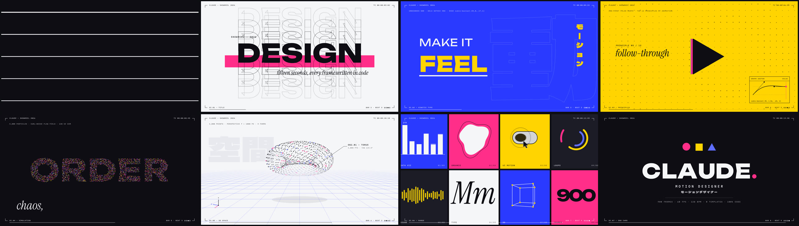

# Claude — Showreel 2026



15秒のモーショングラフィックス・ショーリール。映像も音も、すべてこのフォルダのコードから生成しています（フッテージ、ストック素材、テンプレート、プラグインは一切なし）。

- **[`showreel.mp4`](showreel.mp4)** — 完成版。1920×1080 / 60p / H.264 + AAC 256kbps / 15.0秒
- **`index.html`** — アニメーションエンジン本体。ブラウザで開けばリアルタイム再生・スクラブ・シーン頭出しができます
- **`render.mjs`** — ヘッドレス Chromium で 1 フレームずつ描画し、ffmpeg で書き出すスクリプト

## 構成（128 BPM × 8小節 = 15.000秒ちょうど）

| 小節 | 時間 | シーン | 見せているスキル |
|---|---|---|---|
| 1 | 0:00.0 | SC.00 IGNITION | ドットの落下 → スカッシュ → バウンド → 線に展開 → 5本に分裂 → ストライプで画面を割る |
| 2 | 0:01.9 | SC.01 TITLE | マスクでせり上がるタイポ、スプリットフラップで MOTION → DESIGN、エコーアウトライン、スライス・トランジション |
| 3 | 0:03.8 | SC.02 KINETIC TYPE | スロットマシン式のワード切り替え、伸縮するアンダーライン、縦組みカタカナ、「O」の中へのズームスルー |
| 4 | 0:05.6 | SC.03 PRINCIPLES | アニメーション12原則のうち4つ（スロー・イン/アウト、スカッシュ&ストレッチ、フォロースルー、アンティシペーション）を図形で実演。右下のグラフエディタには、その動きを実際に駆動しているイージングカーブを表示 |
| 5 | 0:07.5 | SC.04 SIMULATION | 4,000粒子の爆発 → カールノイズの流れ場 → 文字「ORDER」に整列 → 風で吹き飛ぶ |
| 6 | 0:09.4 | SC.05 3D SPACE | 2,000点のポイントクラウドが 球 → トーラス → 立方体 → 二重らせん とモーフ。透視グリッド、追従コールアウト、軸ギズモ付き |
| 7 | 0:11.3 | SC.06 RANGE | ウィップパンから8つのループ（データビズ、有機形状、UIマイクロインタラクション、ローダー、音、タイプ、3D、カウンター）を16分音符でタイル表示 |
| 8 | 0:13.1 | SC.07 END CARD | ロゴマークの組み上げ、トラッキングで締まる名前、冒頭のドットがピリオドとして戻ってくるブックエンド |

画面の四隅は、モーションデザイナーが普段見ている作業ビューポートを模した HUD です（タイムコード、シーン番号、小節/拍カウンタ、進行バー）。

## 技術メモ

- **モーションブラー**: 1フレームにつき 10 枚（ウィップ、ズーム、スライス部分は 24 枚）のサブフレームを描き、180°シャッターで平均化しています。ブラーは後処理のフェイクではなく、実際の動きから生まれたものです
- **決定論的レンダリング**: すべての描画は時刻 `t` の純関数です。粒子シミュレーションだけは起動時に 120Hz で事前計算し、補間して使います。どのフレームも単独で再現できるので、4プロセス並列で書き出せます
- **サウンド**: `OfflineAudioContext` でキック、クラップ、ハット、ベース、パッド、ライザー、インパクト、ウーッシュ、スプリットフラップのクリック音などを全部シンセシスし、映像のカットと同じ拍グリッドに配置しています（F マイナー → A♭ メジャーで解決）
- **フォント**: Unbounded（ディスプレイ）、Instrument Serif Italic（キャプション）、Martian Mono（HUD・技術ラベル）、Dela Gothic One（日本語、使用文字だけのサブセット）。すべて `fonts/` にローカル同梱

## 名前を差し替える

`index.html` 冒頭の `CONFIG` を書き換えて再レンダリングするだけです。

```js
const CONFIG = { name: 'CLAUDE', role: 'MOTION DESIGNER', roleJP: 'モーションデザイナー', year: '2026' };
```

日本語の役職名を変える場合は、`fonts/dela-gothic-jp.woff2` のサブセットにその文字を含め直してください（Google Fonts の `&text=` パラメータで取得できます）。

## 書き出し

```bash
cd showreel
npm install                      # Playwright（Chromium は別途インストール済みの前提）
FFMPEG=/path/to/ffmpeg node render.mjs            # → out/showreel.mp4
FFMPEG=/path/to/ffmpeg node render.mjs --stills 150,480,880   # 確認用の静止画とコンタクトシート
```

ffmpeg は libx264 を含むビルドが必要です。4ワーカーで数分かかります。
