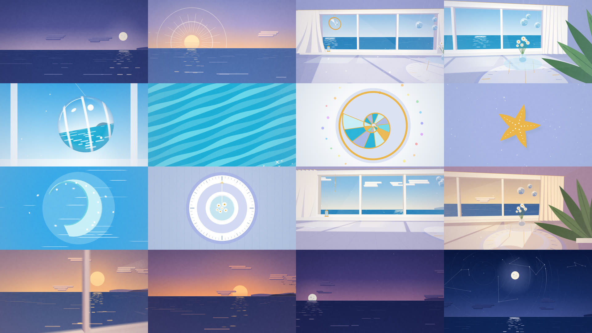

# Sundial — 30秒ループ（第3案）



海辺の部屋で過ごす一日を、夜明け前から次の夜明け前まで 30 秒のシームレスループにしました。窓から差す光が、日時計の影のように床の上を回ります。日の出の頃は長く伸び、正午には一番短くなり、夕方には金色になってまた長く伸び、夜は月の光で淡い青になります。

- **[`sundial.mp4`](sundial.mp4)** — 完成版です。1920×1080 / 60p / H.264 + AAC 320kbps / 30.000 秒 / -16 LUFS。ループ再生でつなぎ目なく回ります
- **`index.html`** — エンジン本体です。ブラウザで開くと、リアルタイムで再生・スクラブできます（下に今の時刻が出ます）
- **`render.mjs`** — 書き出しスクリプトです

## 色

添付のカラーサンプル（海辺の部屋の朝・昼・夕方・夜）から、時刻ごとの色を取りました。朝はアジュールと白と暖かいクリーム、昼はターコイズと白、夕方はオレンジの太陽と紫の空と紺の海、夜は紺と月の白とラベンダーです。この 9 つの時刻の色を OKLab 色空間で補間しているので、時刻が進むにつれて空も海も部屋も途切れずに色が移ります。サンプルにある緑（観葉植物）と金色（オウムガイのサンキャッチャー、ランタン）も差し色に使っています。

## 構成と緩急（96 BPM × 12 小節 = 30 秒）

拍を時刻に変換するスプライン（単調増加で、行き過ぎのないもの）で、一日の進む速さそのものに緩急をつけています。

| 時間 | 時刻 | 場面 | 緩急 |
|---|---|---|---|
| 0.0–2.5 秒 | 4:30–5:30 | 夜明け前。沈んでいく月、消えていく星、水平線に差すラベンダーの光 | ゆっくり |
| 2.5–5.0 秒 | 5:30–6:30 | 日の出。縞の入った太陽が昇り、光線とリングが放たれ、鳥が横切る | 一撃 |
| 5.0–10.0 秒 | 7:00–10:30 | 窓を抜けて部屋の中へ引きます。突風でカーテンが大きくはためき、ガラスが鳴ります。後半はタイムラプスで床の光が回り、手前を観葉植物が横切ります | 中→速 |
| 10.0–13.75 秒 | 11:00–12:00 | 昼。拍ごとに 6 つのクローズアップへカットします（逆さの海が映るガラス玉、海のきらめき、オウムガイのステンドグラス、ホタテ貝とヒトデ、立体的にひるがえる波、真上の太陽） | 最速 |
| 13.75–15.0 秒 | 12:00 | 正午。真上から見た日時計です。テーブルの影が一番短くなったところで、音も絵も完全に止まります | 完全な静止 |
| 15.0–21.25 秒 | 12:40–18:00 | 午後から夕方。床すれすれのカメラで光が一気に反対側へ回ったあと、金色の長い夕方になり、ランタンが灯ります。そのまま窓を抜けて外へ出ます | 速→ゆっくり |
| 21.25–25.0 秒 | 18:00–20:30 | 日没。縞の入った太陽が沈み、閃光が走り、夜が一気に落ちます。星が一つずつ灯り、月が昇ります | 一気に |
| 25.0–30.0 秒 | 20:30–4:30 | 夜。カメラが空へ傾き、極を中心とした点線の同心円と目盛り（星図）が描かれ、星座が結ばれ、星の軌跡が伸び、流れ星が一つ流れます。そして夜明け前へ戻ります | 静か |

## つくり

- **部屋は 3D です**：ピンホールカメラ、ニアクリップ、フラットな面塗りだけで描いています。カメラは窓の外から部屋の中へ、部屋の中からまた外へと、一続きの動きで移動します。空と海は無限遠にあるので、カメラが回っても平行移動しても、太陽や月や水平線はずれません
- **日時計の光**：窓の 3 枚のガラスの四隅から、太陽（夜は月）の方向に光線を伸ばし、床に落ちる光の形をそのまま計算しています。テーブル、脚、花瓶、吊るしたガラス玉、観葉植物の葉、サンキャッチャーは、その光の中に影を落とします。光の筋（ガラスごとの光の柱）と、その中を漂う埃も同じ光の向きから計算しています。サンキャッチャーは床に虹色の光の粒を投げます
- **テーブルの下のラグは日時計の文字盤です**：1 時間ごとの目盛りと、3 時間ごとの金の目盛りが入っています。正午の場面では、これを真上から見ています
- **風**：1 ループに 3 回の突風があります。カーテン、吊るしたガラス、サンキャッチャー、花、観葉植物、音の風切りが、すべて同じ風の関数で動きます
- **質感**：リファレンスにならって、紙のむら（ソフトライト）と、毎秒 12 回変わるグレイン（オーバーレイ）を全体にかけています
- **モーションブラー**：サブフレームを平均して、シャッター角 180° 相当にしています（速い場面は 12 サンプル、それ以外は 6 サンプル）

## 音

BGM は主役にせず、部屋と海の音を中心にしています。波の音（室内ではこもります）、突風に合わせた風、ガラスの鈴の音、時刻に合わせて明るさが変わるパッド、昼のカットごとのヒット、正午の完全な無音、ランタンが灯る音、日没のうねり、星が灯るたびの小さな音、月の出の鐘、流れ星の音です。キーは D、テンポは 96 BPM で、3 周分をレンダリングして中央の 1 周を使っています。

## 参考にした動画から取り入れたこと（模倣はしていません）

- 紙のようなグレインの上に乗る、フラットな面のイラスト
- 厚みのある平面図形が立体的にひるがえる動き、長く伸びる柔らかい影、パースのついた空間
- 太陽の放射線と同心円、点線の軌道や目盛りのある星図、星座の線
- 色面で切り替わるカット、グラデーションの球

一日という構成、日時計の光、部屋の中のモチーフ（オウムガイのサンキャッチャー、吊るしたガラス玉、デイジー、ランタン、窓とカーテン）は、カラーサンプルの海辺の部屋から起こしています。

## シームレスループの検証

- フル書き出しのフレーム 0 と、単独で描いたフレーム 1800 は全画素が一致しました
- 音はループの継ぎ目の段差が 0.0004〜0.007 で、隣り合うサンプル間の平均的な変化（0.014）より小さく、クリックは出ません

## 書き出し

```bash
cd sundial
npm install
FFMPEG=/path/to/ffmpeg node render.mjs          # → out/sundial.mp4（4ワーカーで約5.5分）
FFMPEG=/path/to/ffmpeg node render.mjs --stills 0,215,610,870,1150,1650   # 確認用の静止画
```
